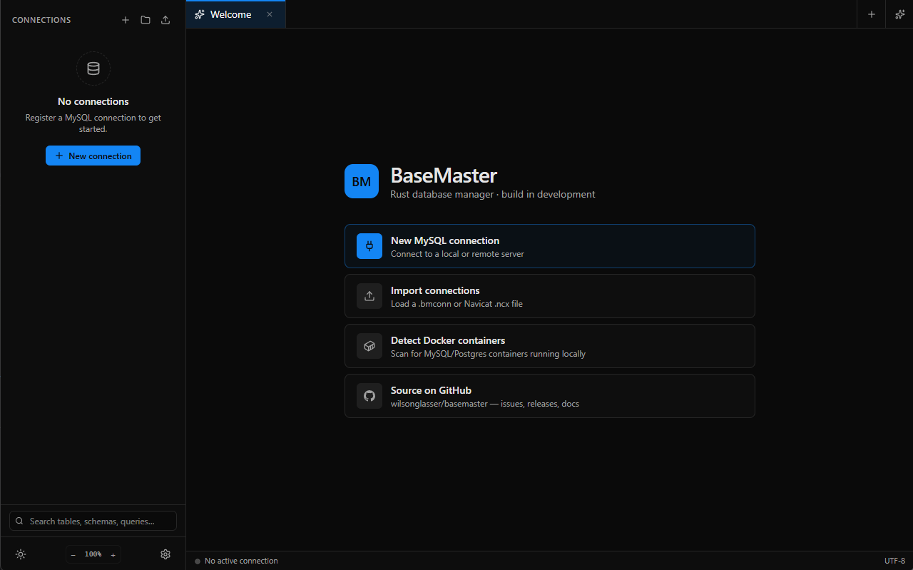
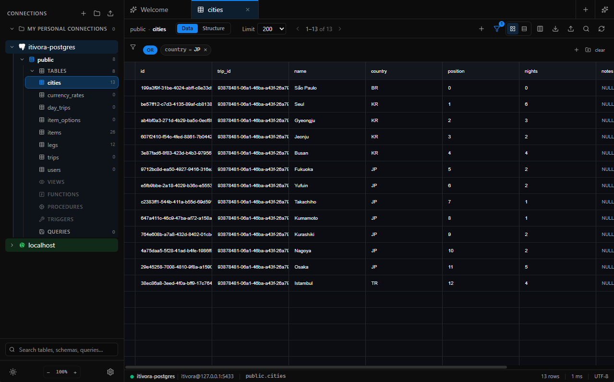
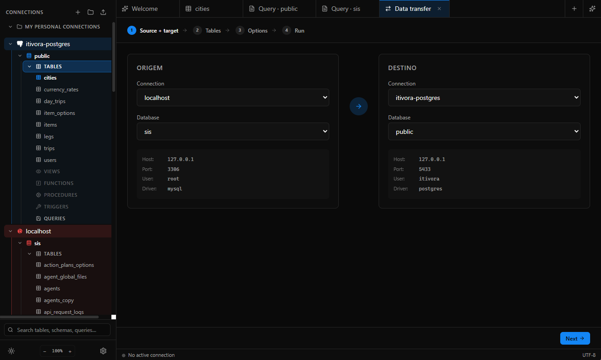
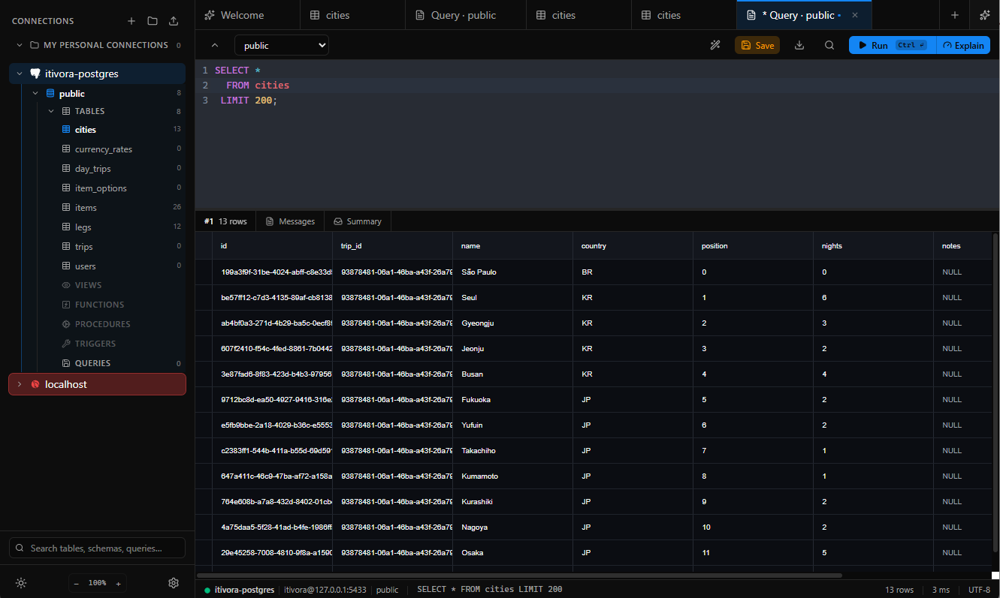

<p align="center">
  
</p>

<h1 align="center">BaseMaster</h1>

<p align="center">
  A modern desktop database manager built in Rust — fast, native, multi-driver.
</p>

<p align="center">
  <a href="https://github.com/wilsonglasser/basemaster/actions/workflows/ci.yml"></a>
  <a href="https://github.com/wilsonglasser/basemaster/releases/latest"></a>
  
  
  <a href="LICENSE"></a>
  <a href="https://basemaster.org"></a>
  <a href="https://ko-fi.com/wilsonglasser"></a>
  <a href="https://buymeacoffee.com/wilsonglasser"></a>
</p>

<p align="center">
  🌐 English · Português
</p>

---

## Download

Pre-built binaries from the [latest release](https://github.com/wilsonglasser/basemaster/releases/latest). Tauri-action names assets using the current version — replace `X.Y.Z` with the tag you want.

| Platform | Architecture | Direct links |
|----------|--------------|--------------|
| **Windows** | x86_64 | [`.msi` installer](https://github.com/wilsonglasser/basemaster/releases/latest) · [`.exe` setup](https://github.com/wilsonglasser/basemaster/releases/latest) |
| **macOS** | Apple Silicon | [`.dmg`](https://github.com/wilsonglasser/basemaster/releases/latest) |
| **Linux** | x86_64 | [`.deb`](https://github.com/wilsonglasser/basemaster/releases/latest) · [`.rpm`](https://github.com/wilsonglasser/basemaster/releases/latest) · [`.AppImage`](https://github.com/wilsonglasser/basemaster/releases/latest) |

All links go to the latest release page — pick the file that matches your OS. Coming soon: `winget install WilsonGlasser.BaseMaster`.

---

## What is BaseMaster?

BaseMaster is an open-source desktop database client — an alternative to Navicat, DBeaver and TablePlus. Multi-driver, full SQL editor, spreadsheet-style editable grid, data transfer between connections, built-in AI agent and MCP server. All shipped as a single native binary, no Electron.

### Why?

Existing alternatives are either paid and closed-source (Navicat, TablePlus), Electron-based and heavy (DBeaver), or terminal-only (`psql`, `mysql`). BaseMaster aims to be **fast, native, and have the UX a professional DBA or dev expects**.

## Screenshots

<p align="center">
  
</p>
<p align="center">
  
</p>
<p align="center">
  
</p>
<p align="center">
  
</p>

## Features

### Connectivity
- **Multi-driver** — MySQL, MariaDB, PostgreSQL, SQLite (with optional SQLCipher).
- **SSH tunnel** — Tunneling via [russh 0.60](https://github.com/warp-tech/russh), key + passphrase auth.
- **SSL/TLS** — Configurable per connection.
- **Docker auto-discovery** — Detects MySQL/Postgres containers running on the host and suggests connections.

### SQL Editor
- **CodeMirror 6** — Modern editor with schema-aware autocomplete.
- **Format SQL** — `Ctrl+Shift+F` reformats the current query.
- **Granular execution** — `Ctrl+Enter` runs the statement under the cursor, or the selection.
- **History & saved queries** — Persisted locally in SQLite.

### Editable Grid
- **[Glide Data Grid](https://github.com/glideapps/glide-data-grid)** — Canvas renderer, scales to 100k+ rows without lag.
- **Navicat-style UX** — Multi-fill, paste multi-row/multi-col, edits stay in pending and only commit on explicit apply.
- **Strong types** — Bytes (hex / utf-8 preview), formatted JSON, dates, enums, arrays, UUID.

### Schema Editor
- **Full UI** — Create and edit tables, columns, indexes, foreign keys and triggers through forms.
- **Per-table tabs** — Data, Structure, DDL, Indexes, Triggers.
- **Shortcuts** — `F2` to rename, `Ctrl+D` opens the active table's structure.

### Data Transfer (between connections)
- **Intra-table parallelism** — Chunked copy in parallel, configurable per job.
- **Copy FKs** — Recreates relationships on the destination when `create_tables=true`.
- **Copy triggers** — `SHOW TRIGGERS` + `SHOW CREATE TRIGGER` for MySQL.
- **Live progress** — Rows/second, ETA, pause and cancel.

### Import / Export
- **`.bmconn`** — Our own format, exports connections + saved queries.
- **`.ncx`** — Import Navicat connections, with native Blowfish-ECB decryption.
- **Data** — CSV, JSON and Excel with fuzzy auto-mapping between source and destination columns.

### AI Integration
- **Built-in agent** — 19 tools to inspect schemas, run queries, explain plans and edit data.
- **12 providers** — Anthropic, OpenAI, Gemini, OpenRouter, Groq, DeepSeek, Mistral, xAI, Perplexity, Together, Fireworks, Cerebras.
- **MCP server** — Expose your connections to external AI clients (Claude Code, Cursor) via JSON-RPC over stdio.

### UX
- **Resizable sidebar** — Drag to adjust, state persisted.
- **Command palette** — `Ctrl+K` for any action.
- **Full cheat-sheet** — `Ctrl+/` lists every shortcut.
- **Themes** — Dark / Light.
- **i18n** — English and Portuguese (Brazil).

### Storage & Privacy
- **Local SQLite** — Profiles, saved queries, history, settings — all offline.
- **OS keyring** — Connection passwords stored in Credential Manager (Windows) / Keychain (macOS) / libsecret (Linux).
- **No telemetry** — No data leaves your machine, except the calls you explicitly make to AI providers you configure.

## Architecture

```
+----- Tauri 2 Application (WebView) ---------------------------+
|                                                               |
|  React + TypeScript (Vite)                                    |
|  Sidebar + Tab Bar + SQL Editor + Grid + AI Chat              |
|                                                               |
+---------------------------------------------------------------+
|  src-tauri (Rust backend, Tauri commands, MCP server)         |
+---------------------------------------------------------------+
|  driver-mysql   |  driver-postgres  |  driver-sqlite          |
|  (sqlx, covers  |  (sqlx)           |  (sqlx + SQLCipher opt) |
|   MariaDB)      |                   |                         |
+-----------------+-------------------+-------------------------+
|  core           |  store                                      |
|  (trait Driver +|  (local SQLite: profiles, queries,          |
|   Value, types) |   history, settings)                        |
+---------------------------------------------------------------+
```

| Crate | Purpose |
|-------|---------|
| `basemaster` (src-tauri) | Tauri app, commands, MCP server, data transfer, import/export |
| `core` | `Driver` trait, `Value` enum, types shared across drivers |
| `driver-mysql` | MySQL / MariaDB driver via sqlx |
| `driver-postgres` | PostgreSQL driver via sqlx |
| `driver-sqlite` | SQLite driver via sqlx (+ optional SQLCipher) |
| `store` | Local SQLite store for profiles, saved queries, settings |

## Tech Stack

| Layer | Technology |
|-------|------------|
| Desktop shell | Tauri 2 (WebView2 / WebKit / WebKitGTK) |
| Frontend | React 18 + TypeScript + Vite |
| UI | shadcn/ui + Radix + Tailwind |
| Grid | Glide Data Grid |
| SQL editor | CodeMirror 6 |
| AI SDK | Vercel AI SDK (12 providers) |
| Backend | Rust stable + Tokio |
| DB clients | sqlx (MySQL, Postgres, SQLite) |
| SSH | russh 0.60 |
| Navicat decrypt | `blowfish` + `ecb` + `quick-xml` |
| Local storage | SQLite |
| Keyring | `keyring` crate (OS-native) |
| Error reporting | Sentry (optional, via env var) |

## Building from Source

### Prerequisites

- Rust stable ([rustup](https://rustup.rs/))
- Node 20+ and [pnpm 10](https://pnpm.io/)

**Linux:**
```bash
sudo apt install -y libwebkit2gtk-4.1-dev libappindicator3-dev librsvg2-dev patchelf libssl-dev libxdo-dev build-essential
```

**macOS:** `xcode-select --install`

**Windows:** Visual Studio Build Tools with the C++ workload + WebView2 runtime.

### Build & Run

```bash
git clone https://github.com/wilsonglasser/basemaster.git
cd basemaster
pnpm install
pnpm tauri dev            # Dev with hot reload
pnpm tauri build          # Release → src-tauri/target/release/bundle/
cargo check --workspace   # Rust check
pnpm tsc --noEmit         # TS check
```

Code signing details (SignPath Foundation for Windows, Apple Developer for macOS) and winget publishing are documented in [`docs/RELEASE.md`](docs/RELEASE.md).

## Usage

1. **First launch** — Empty profile, no master password.
2. **New connection** — `+` button, pick a driver, fill host/port/credentials. Test before saving.
3. **Query** — `Ctrl+T` opens a new SQL tab, `Ctrl+Enter` runs.
4. **Edit table** — Double-click a table → Data tab. Edits stay pending, `Ctrl+S` applies.
5. **Transfer** — Connection menu → Data Transfer. Pick source/destination and tables, configure parallelism.
6. **AI** — Settings → AI, configure provider and API key. Chat button appears in the sidebar.
7. **Import Navicat** — File → Import `.ncx`, enter the master password if the file has one.

### Shortcuts

| Shortcut | Action |
|----------|--------|
| `Ctrl+K` | Command palette |
| `Ctrl+T` | New SQL tab |
| `Ctrl+W` | Close tab |
| `Ctrl+Enter` | Run query |
| `Ctrl+Shift+F` | Format SQL |
| `Ctrl+D` | Structure of the active table |
| `F2` | Rename (column, table, connection) |
| `Ctrl+/` | Full cheat-sheet |

## Roadmap

| Version | Status | Scope |
|---------|--------|-------|
| **v0.1** | **In Progress** | MySQL/MariaDB/Postgres/SQLite drivers, SQL editor, editable grid, schema editor, data transfer V1.2, import/export, AI chat, MCP server, Docker discovery |
| **v0.2** | Planned | `EXPLAIN` visualizer, schema diff, biometric unlock, chained SSH jump hosts |
| **v0.3** | Planned | ER diagram, visual schema refactor, cross-install sync over QUIC |

## Contributing

PRs welcome. Open an issue before large changes so we can align on scope.

## License

[MIT](LICENSE) — Free and open-source.

---

<p align="center">
  Built with Rust and SQL, for people who live in databases.
</p>
